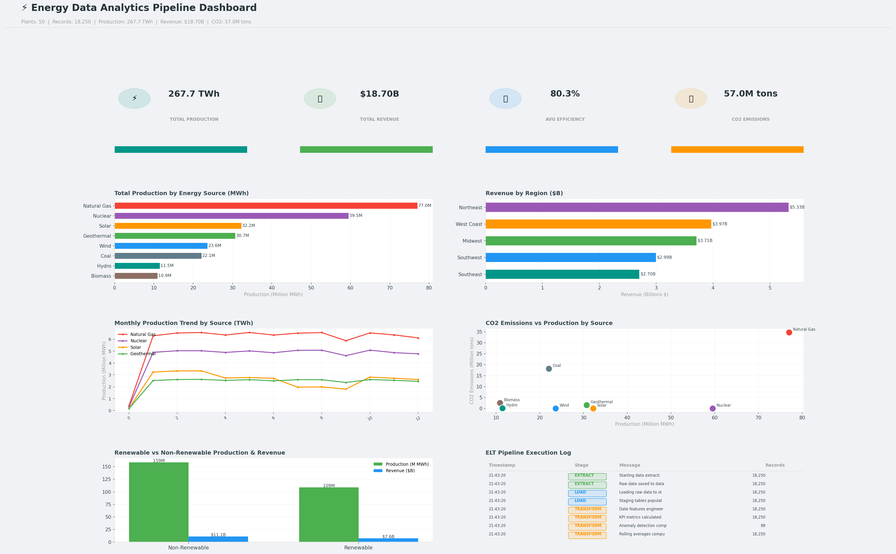

# Energy Data Analytics Pipeline

## Pipeline Overview
- **Total Records Processed:** 18,250
- **Plants:** 50
- **Days of Data:** 365
- **Total Production:** 267.7 TWh
- **Total Revenue:** $18.70B
- **Total CO2 Emissions:** 57.0M tons
- **Avg Efficiency:** 80.33%
- **Anomalies Detected:** 89

## ELT Pipeline Stages
1. **EXTRACT** — Raw data extraction, validation, missing value checks
2. **LOAD (Staging)** — Load raw data to staging tables
3. **TRANSFORM** — Feature engineering, KPI calculation, anomaly detection, rolling averages
4. **LOAD (Analytics)** — Load transformed data to analytics tables

## Dashboard Visualizations

1. KPI Cards — Production, Revenue, Efficiency, CO2
2. Production by Energy Source
3. Revenue by Region
4. Monthly Production Trend by Source
5. CO2 Emissions vs Production Scatter
6. Renewable vs Non-Renewable Comparison
7. ELT Pipeline Execution Log

## Energy Sources
- Renewable: Solar, Wind, Hydro, Geothermal, Biomass
- Non-Renewable: Natural Gas, Coal, Nuclear

## Technologies
- Python, Pandas, NumPy
- SQLite (ELT Pipeline)
- Matplotlib, Seaborn
- Apache Airflow (Scheduling)
- Google Colab (T4 GPU)
